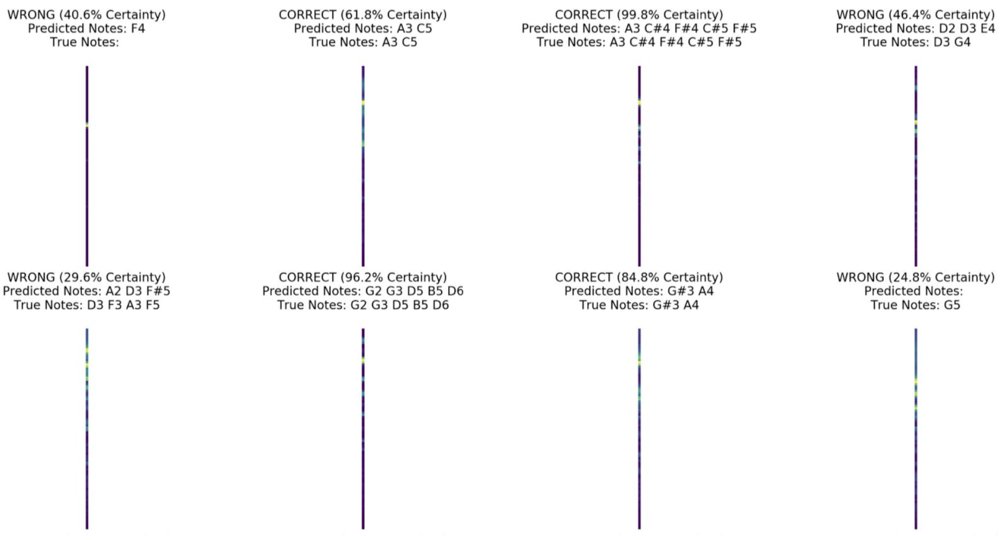

# audioNet
Classify Piano Audio to Music Notes using Neural Networks

Built by Gautam Banuru, Sahil Katrekar, and Calvin Hsieh

Check HiddenPower Demo.ipynb for a demo on the project.

## 1. Project Summary

This project aims to translate raw piano audio into written music notes. In order to facilitate this translation, the
audio is first preprocessed into a frequency distribution diagram known as a spectrogram -- a visual
representation of a signal’s spectrum of frequencies varied against time. This spectrogram encapsulates the
full audio length. Next, this spectrogram is divided into smaller spectrograms, each representing a 50
millisecond chunk of audio with their respective frequencies. Finally, these slices of the original spectrogram
form the input type for our machine learning model.

A feed-forward neural network model is used to predict the note(s) being played for a particular 50 millisecond
audio chunk. The neural network (dubbed AudioNet) predicts a vector of identified music notes as output,
which is compared to the corresponding ground truth vector of music notes. Cross-entropy loss and the
stochastic gradient descent optimizer are used in order to train AudioNet. After training and iterating on the
model architecture many times, an optimal configuration of linear layers and hidden nodes was found. This
architecture led to a best classification accuracy of 72.32%. The main takeaway was that only complicated
models, such as neural networks, could handle the dataset variety. Also, training is very slow for this particular
problem (3-10 hours depending on model), and an adaptive learning rate should be used to improve training
speed.

## 2. Data Sets

The Multimodal Audio Sheet Music Dataset (MSMD) is a synthetic dataset of 497 pieces of classical piano
music that contains both audio and score representations of the pieces aligned at a fine-grained level (344,
pairs of noteheads aligned to their audio counterpart)​ 1 ​. The MSMD Python library contains functions to
manipulate the dataset, allowing the user to identify the sheet music notes played during specific audio
segments in the form of a spectrogram (See Figure 1).

While the dataset has 497 pieces of classical piano music, some pieces were split up into multiple folders for a
total of 697 musical snippets. Some snippets were incomplete as they did not contain the performance data
needed within. Filtering all the data left it with 601 usable musical snippets for the neural net to process. Each
musical snippet provided the following: the audio of the song, the sheet music for the song, and the MIDI
matrix identifying the piano keys pressed every 50 milliseconds.

While the MIDI file format sound frequency spans 128 different sounds, the 88 key piano range within the MIDI
format was verified to be the only sounds present and no processing on that front was needed. Originally, it
was believed that the MIDI matrix was already n-hot encoded where 0’s meant a key was not pressed and 1’s
were pressed. However, the MIDI matrix sometimes contained 2’s or even 3’s in the matrix. Further research into the MIDI files revealed that some of the snippets had multiple tracks layered on top of each other and the
2’s and 3’s signify the tracks overlapping on certain notes (See Figure 2).

MSMD is the only dataset used. The MSMD tutorial, guide, and helper functions can be found here
https://github.com/CPJKU/msmd​. The songs in its file structure used with MSMD (8.9 GB size) can be
downloaded with this link: ​https://zenodo.org/record/2597505/files/msmd_aug_v1-1_no-audio.zip?download=

<b>Figure 1: ​Spectrogram audio-aligned with sheet music.</b>

 

<b>Figure 2: Eugenia by Scott Joplin in MIDI editor. The red and green bars on the same lines are not sequential, they’re overlapping.</b>

## 3. Technical Approach

We use a deep neural network architecture consisting of several fully connected and ReLU activation layers.
The input to the AudioNet neural network is a flattened fixed-size spectrogram. A data preprocessing pipeline
is created to generate this spectrogram from a raw audio file. The pipeline reads audio waves into an
amplitude vector, reshapes the vector into 1/20th of a second chunks, and then applies a fourier transform to
each chunk to generate a spectrogram from the underlying frequencies (See Figure 3). Each audio clip interval
is 1/20th of a second; a small time interval prevents the capturing of notes played in succession to fit the
structure of our neural network. The dimensions of the spectrogram input are 92x1, allowing only frequencies
from 30Hz to 16kHz which result in those 92 frequency bins.

The output layer features 35,531 classes representing all the combinations of the 88 piano notes played in the
MSMD dataset songs. A softmax function is applied to the output layer to convert each output node to a
probability between 0 and 1. The class corresponding to the output node with the highest probability is the
predicted answer. While 35,531 classes sounds like a lot, neural networks are capable of high accuracy even
with millions of output classes. The target vector is an n-hot encoded vector of size 88 representing the notes
being played as identified by the ground truth MIDI matrix corresponding to the audio clip the spectrogram was
created from (See Figure 4). The MIDI matrix is of size 88x1 and represents all 88 piano keys with a 1 if
pressed and 0 otherwise.

The training process uses cross entropy loss as the loss function for comparing the predicted class and target
class in order to optimize the weights of the neural network through backpropagation. The optimization method
used in conjunction with the learning rate is stochastic gradient descent.

To train the neural network the MSMD data must be preprocessed and placed into train/validation/test folders.
The spectrograms for a song are sliced into 1/20th of a second intervals and paired with their corresponding
MIDI matrix class provided by the MSMD dataset. For an easy naming convention, each MIDI matrix is
converted into a base 2 string and then into a base 10 string. The base 10 MIDI matrix string is the class name
for a folder and the contents of the folder are 92x1 spectrogram images (saved as .png) corresponding to the
class. The split_folders python library is then used to split the preprocessed data into 60% train, 20%
validation, and 20% test sets.

To improve the AudioNet test accuracy we tried different model architectures and modified hyperparameters
such as batch size, epoch count, and learning rate.

If we have time, we will create sheet music images from audio segments. User created audio clips can be
transformed into a spectrogram that will serve as an input into AudioNet to predict the correct MIDI matrix. The
MIDI matrix can be collected to generate a sheet music image using a Python library called LilyPond. We may
also make a Python web application using Flask that allows a user to record an audio segment and the notes
recorded will be displayed to the user.

As per our research, nobody else seems to be doing musical note classification specifically with this dataset.
However the task of musical note classification has been done before (See Resources Section #2). The way Patel approached the problem
was similar to ours. He used digital signal processing techniques to identify the frequency and respond with the
musical note equivalent.

<b>Figure 3: Data Preprocessing </b>

 

<b>Figure 4: Training the PyTorch model</b>

## 4. Experiments and Evaluation
AudioNet was trained on an Ubuntu server instance hosted on Microsoft Azure, consisting of 6 CPU cores, 56
GB of RAM, and 1 NVIDIA TESLA K80 GPU. The CUDA enabled GPU allowed for faster training of our neural
network model when compared to traditional CPU usage. The 1.5 million data points created from the MSMD
dataset was divided into a 60/20/20 Train/Validation/Test set split. 906,425 data points were in the training set
and 293,785 data points were in the validation set. The test set was not used in our analysis because we were
not able to increase the validation accuracy high enough to justify its use. As such we used the validation set to
determine the accuracy of AudioNet. We used the cross-entropy loss function to determine how the neural
network weights are adjusted during backpropagation.

Training a neural network to achieve the highest accuracy involves updating a variety of hyperparameters
including the model architecture, batch size, learning rate, and number of epochs. We performed 25 separate
tests adjusting these hyperparameters in a jupyter notebook environment. These tests comprised a total of 68
hours of training. Table 1 shows a subset of the 25 tests performed.

| Test Number | Hidden Layers | Hidden Layer Structure | Batch Size | Epoch Count | Learning Rate | Validation Accuracy |
| :---------: |:-------------:| :---------------------:|:----------:|:-----------:|:-------------:|:-------------------:|
|14A |3| 300,800,300| 16| 20| 0.1| 55.24%|
|15A |4| 300,1000,600,300| 16| 20| 0.1| 61.75%|
|18B |3 |300,1000,600 |16 |30 |0.05| 65.62%|
|19B |3 |300,1000,600| 16| 30| 0.01| 59.70%|
|20B |3 |300,1000,600 |8 |30 |0.05 |64.39%|
|22C |4 |300,1000,600,300| 16| 50| 0.01| 72.32%|
|24C| 4 |300,1000,600,300| 16 |50 |0.001 |55.11%|

<b>Table 1: Subset of Tests Performed</b>

In the group A tests, having more hidden layers in test 15A compared to 14A resulted in an additional 6%
accuracy. In the group B tests, having a larger learning rate in test 18B compared to 19B resulted in an
additional 6% accuracy. Having a smaller batch size in test 20B compared to 18B reduced accuracy by 1%. In
the group C tests, having an extremely small learning rate in test 24C compared to 22C results in a 17%
accuracy drop. Training accuracy increases quickest during the first 10 epochs. Test 22C had the best
accuracy at 72.32%. Figure 5 in Appendix B shows a couple predictions done on the spectrogram slice using the best model along with the notes predicted and the AudioNet certainty. Given the 35K+ classes, audioNet
performs decently given that it is a fully connected neural network.

The baseline classifier used to compare AudioNet to was a simple perceptron classifier trained using the sci-kit
learn library. The perceptron classifier utilizes early stopping to avoid training for longer than necessary due to
the amount of data points in our data set. The maximum number of iterations/epochs for the classifier was set
to 40. The tolerance used for early stopping was a difference of 0.001 between epochs. The random state of
the classifier was set to 0 for reproducibility purposes. The eta0/constant which the updates are multiplied by
was set to 0.1 to avoid missing/overshooting an optima and to hopefully reach an early stop if possible. To
calculate the loss, for parity between the baseline and AudioNet, we used the cross-entropy loss function as
well.

Other baseline classifiers besides the perceptron were considered during creation. Some of the other types of
classifiers considered during creation was a Bayesian regression model, a ridge regression model, and a
random forest model. Both the Bayesian model and ridge regression model took extremely long to train since
sci-kit learn does not provide any form of GPU support. In order to try out a random forest model, it was
necessary to train perceptrons which led to the discovery that a single perceptron classifier also took very long
to train so random forest as a possibility was scrapped. Ultimately, with all the efficiency issues with creating a
baseline classifier, we settled on a single test run on a fraction of the data so we can focus on improving
AudioNet. The poor accuracy of the baseline perceptron classifier could be attributed to many different factors:
the dataset having too many classes that the classifier did not see when training, a single perceptron classifier
not being complex enough to predict the data without overfitting, or the hyperparameters not being tuned
enough.

|Max Epochs| Tolerance |eta0/multiplication constant| Accuracy|
|:--:|:--:|:--:|:--:|
|40 |0.001| 0.1| 21.04%|

<b>Table 2: Baseline Classifier Result</b>

## 5. Lessons Learned and Insights
Throughout the development process, we iterated through different model architectures, experimented with
various techniques for audio processing, and found ways to optimize our code. We made many mistakes, but
gained valuable insights along the way. For instance, one key takeaway was that our dataset was of high
dimensionality, and our baseline classifier (a simple perceptron) performed rather poorly. Single layer neural
networks can at best approximate a linear function; however, our data was not linearly separable. By
upgrading to a feed-forward neural network with four linear layers, multiple hidden nodes, and a ReLU
activation function for each layer, we were able to more closely model the patterns found in the data.

Another observation was that training time for this particular classification problem was slow (3-10 hours
depending on model type). Even with utilizing a powerful machine with a CUDA enabled GPU, we were not
surprised by this slow training time. This is for a variety of reasons: our training data set size is huge, we use
roughly 2,000 hidden nodes in our architecture, and our epoch count is 50. One epoch (iteration) takes roughly 35 minutes. One important lesson learned later on from this observation is to employ an adaptive learning rate
in our optimization algorithm to improve training speed. We unfortunately did not have time to implement and
test this in our code, but in any case will be a good tool to use in the future.

Finally, because our neural network input is essentially an image, we learned we could also possibly use a
convolutional neural network (CNN) architecture instead. A CNN is very good for problems related to image
classification and can find patterns within images very easily. A possible future step can be to reshape the
input image into a 2D grid, feed it into a CNN model, and compare performance against our feed-forward
neural network.

If we were a research lab trying to make progress on this problem, we would definitely try to reshape the input
spectrogram into a 2D image and feed it through a CNN model. While this model is definitely more complex
(more variety of layers, stricter requirements for input, more hyperparameters), if tuned correctly can give more
accurate results. We believe that by applying techniques from image recognition, image processing, and by
experimenting with audio preprocessing algorithms other that fourier transform, we would be able to greatly
increase our accuracy. To compare and contrast different algorithms and algorithm configurations, we would
also use a stronger measure of accuracy than success rate (successful number of classifications / number of
inputs). This could be something like a confusion matrix, which shows true/false positives and negatives. This
allows for more detailed analysis than a proportion of correct classifications, and could reveal any patterns
which may be overlooked.

## 6. Resources
    1. Matthias Dorfer, Jan Hajič jr., Andreas Arzt, Harald Frostel, Gerhard Widmer. ​Learning Audio-Sheet
       Music Correspondences for Cross-Modal Retrieval and Piece Identification​ (​PDF​). Transactions of the
       International Society for Music Information Retrieval, issue 1, 2018.
    2. Patel, Jay & E.S., Gopi. (2015). Musical Notes Identification using Digital Signal Processing. Procedia
       Computer Science. 57. 876-884. 10.1016/j.procs.2015.07.499.
       
## APPENDICES
**Appendix A: Software**

**Publicly Available**

1. **Python** : Primary programming language used.
2. **PyTorch** : Used for the creation of the deep neural network that we pass our spectrogram data into.
3. **MSMD Dataset** : Provides us a method of easily retrieving respective spectrogram, audio file, and
MIDI matrix. If we have time, creation of the sheet music will be handled by converting n-hot encoded
vectors to MIDI using the Python MIDI library and then converting MIDI to sheet music using the
mingus/LilyPond library.

**Group Generated**

1. **Preprocess MSMD Raw Data to Usable Format** : We will generate small segments of the audio to
    perform analysis on individual notes played.
2. **Generate Spectrograms Manually from Audio** : While the MSMD dataset provides spectrograms
    for corresponding audio clips, we can also generate spectrograms manually from the audio. This is
    used to build the raw audio to spectrogram preprocessing pipeline.
3. **AudioNet Deep Neural Network** : The deep neural network written in PyTorch is hand tuned by
    varying factors such hyperparameters and the model architecture. We predict the resulting MIDI
    matrix from the neural network through a softmax function. The training and testing framework is from
    an OpenCV.org Deep Learning with PyTorch course with changes made to 1. the data loading
    feature to load our own data and 2. the model architecture/hyperparameters to train our own data.
    
**Appendix B: Additional Results**

<b>Figure 5: Sample Predictions</b>

